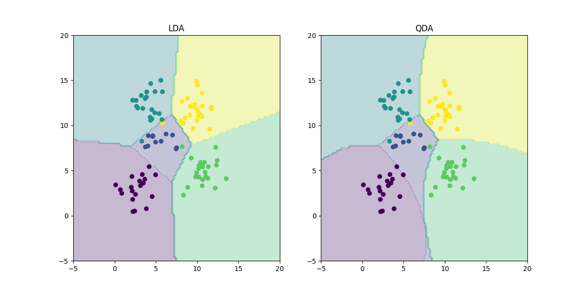
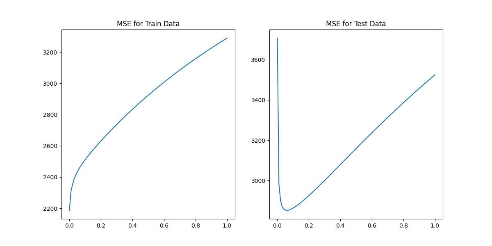
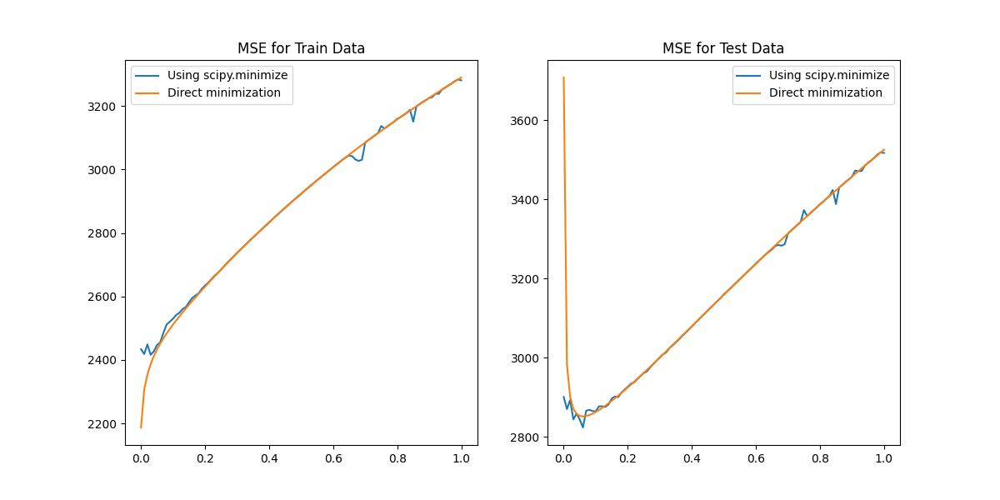
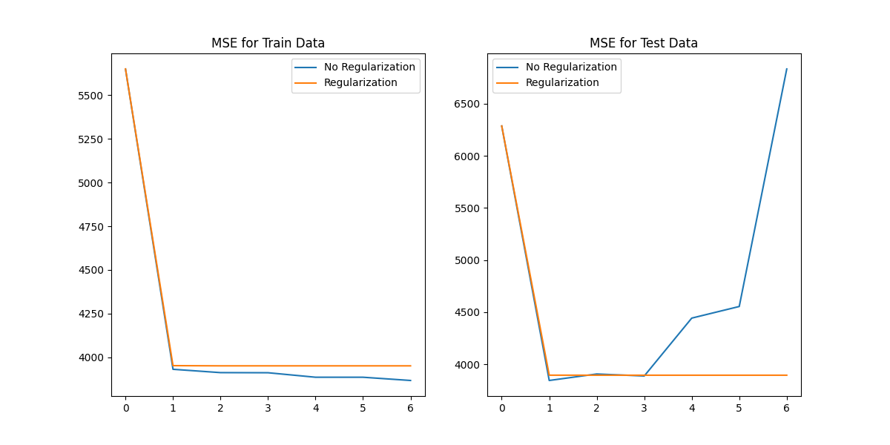

# CSE 574 Project3 Report
* Members in Group 6: Jiabao Yao(50602483), Han Li(50993977)*


## Problem 1
```
LDA Accuracy = 0.97
QDA Accuracy = 0.96
```

## Problem 2
## Problem 3

## Problem 4
```
Optimal lambda = 0.06 for problem 4 with 20 iterations
```
The graph below shows the Mean Squared Error (MSE) for the training and test datasets, obtained using gradient descent-based learning while varying the regularization parameter (λ). The trend of the MSE curve is consistent with the results from Ridge Regression in Problem 3, despite some fluctuations.

The optimal λ value found using gradient descent is 0.06 when the number of iterations is set to 20, which aligns with the result from Problem 3.


## Problem 5
```
Optimal p = 1 for lambda = 0 with mse = 3845.0347301734146
Optimal p = 4 for lambda = 0.06 with mse = 3895.5826682835263
```

The graph below shows some fluctuations between the MSE values obtained using Scipy and direct minimization; however, their overall trends are consistent. As λ increases, the optimal p values also increase.

From the MSE on the training data, the model without regularization performs better as p increases. However, for the test data, the model with regularization performs significantly better, particularly as the value of p increases.


