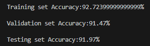
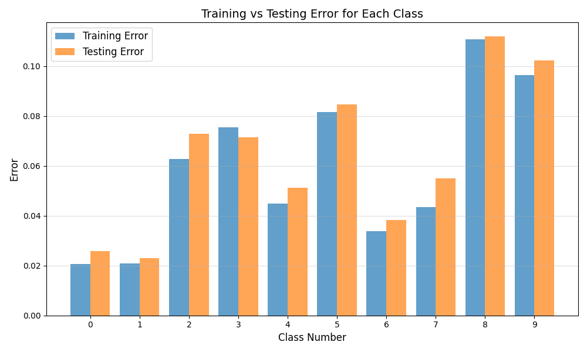
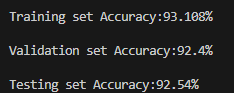

# CSE 574 Project3 Report
*Members in Group 6: Jiabao Yao(50602483), Han Li(50993977)*

## Problem 1 Logistic Regression
The Logistic Regression model for 10 classes permances very well with high trainging, validation, and test accuracy more than 90%.  

To evaluate the performance of this model, we recorded the accuracy for both the training set and testing set across each category. As shown in the graph below, all classes achieve an accuracy of over 90%. Notably, classes 0 and 1 exhibit better performance, while classes 8 and 9 have slightly higher errors compared to the others. This observation aligns with the fact that lower-numbered classes often represent simpler patterns, making them easier to learn. Additionally, the testing set errors are consistently higher than the training set errors, which may be attributed to overfitting. This occurs when the model fits the training data too closely, resulting in higher accuracy on the training set but reduced generalization to unseen data in the testing set.

## Problem 2 Multi-Class Logistic Regression
Compared to one-vs-all strategy, multi-class strategy has higher accuracy over 90%.  
  
The overall performance of the multi-class logistic regression model is outstanding, achieving over 90% accuracy across all three datasets. The training set exhibits slightly higher accuracy compared to the testing and validation sets, which is expected since the model is directly optimized on the training data. However, the slightly higher accuracy on the training set could also indicate mild overfitting. Nonetheless, the above 90% accuracy on both the validation and testing datasets demonstrates that the model generalizes well to unseen data.  

Multi-class logistic regression slightly outperforms the one-vs-all approach across all metrics. This improvement can be attributed to the use of the softmax function, which evaluates all classes simultaneously, resulting in more consistent and balanced predictions. In contrast, the one-vs-all strategy trains separate binary classifiers for each class, which can lead to conflicts in predictions and slightly reduced performance.

## Problem 3

